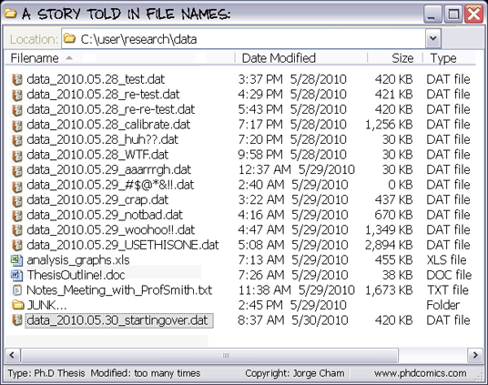
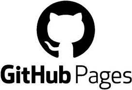

# Workshop Introduction

Follow along with the introductory video, slides, or text below.

<!-- {: .label }
Video
<iframe height="416" width="100%" allowfullscreen frameborder=0 src="https://echo360.ca/media/a65689c0-c35c-4f33-9c12-f0ac97883f54/public?autoplay=false&automute=false"></iframe>

{: .label }
Slides
<iframe src="https://docs.google.com/presentation/d/e/2PACX-1vSB6guZ6tdX2wPcsMAzviOOQrcRAeiUNEIAtIRniSx4C3D0Gl35wi60jB5sRlB9eGfs8dVcNvweXxHY/embed?start=false&loop=true&delayms=3000" frameborder="0" width="100%" height="450" allowfullscreen="true" mozallowfullscreen="true" webkitallowfullscreen="true"></iframe> -->

## What is Version Control?

There are many times in our day to day lives when we want to keep track of different versions of *things*. Most commonly, Keeping track of changes between these different versions is known as **Version Control**.

<ins> *Image credit: [PhDComics](https://phdcomics.com/comics.php?f=1323) \| Image © jorge cham* </ins>

You may have found yourself in a situation like in the image above. While you can do version control manually, there are many disadvantages to it and prone to errors.

- Your work folder will get cluttered really quickly.
- You may accidentally edit or overwrite the wrong file.
- You may also develop a bad naming system for files.
- It's easier to forget or ignore.
- It's harder to keep track of which file has what changes.
- How will this work for collaborative files?

This is where Version Control Systems (like git!) come handy. Version Control Systems automate all the tedious parts of Version Control and also allow you to do a lot more things. Some common features of Version Control Systems include:

- the ability to see a timeline of changes to a file.
- the ability to revert to a previous version easily.
- the ability to create and merge "branches" (different versions of the same file).
- the ability to easily share your files.
- the ability to allow others to modify / contribute to your project.
- the ability to manage contributions and decide what contributions get merged into the main version.

## What is git, GitHub, GitHub Pages, and GitHub Desktop?
 

git is a free and open source **distributed version control system**. It's been around for a very long time and is used for small and big projects alike. Traditionally git is command-line based, meaning that you have to interact with it using text-based commands. However, today there are many graphical interfaces based on git, allowing you to do all the same things you normally would but right at the click of a button. 

GitHub is a web-based hosting service for version control using git. It allows you to use all the functionality of git, as well as a lot of other added features. It provides collaboration tools, automation tools, documentation tools, website hosting tools, and many other features. Since it's web-based, you can access the files from anywhere.

GitHub Pages is a static site hosting service GitHub provides. It takes in HTML, CSS, and JavaScript files hosted in a GitHub "repository" and publishes a website that anyone can access! Alternatively, you can instead use Markdown files (we'll talk about those in the first lesson!) to create web pages using [**Jekyll**](https://jekyllrb.com/), a built-in software within GitHub Pages. This workshop website here is hosted by GitHub Pages and created entirely using Markdown files.

GitHub Desktop is a desktop application that lets you edit files of a Github repository within your local file system on your PC using a GUI interface.

## What should I use a Version Control System for?
- Software projects - e.g. [OpenRefine](https://github.com/OpenRefine/OpenRefine), [GIMP](https://github.com/GNOME/gimp)
- Data - e.g. [OpenIndexMaps](https://github.com/OpenIndexMaps), [Serratus](https://github.com/ababaian/serratus), [and a lot more](https://github.com/awesomedata/awesome-public-datasets)
- Books - e.g. [SmoothCoffeeScript](https://github.com/autotelicum/Smooth-CoffeeScript), [Git from the Bottom Up](https://github.com/jwiegley/git-from-the-bottom-up), [and a lot more](https://github.com/topics/books)
- Websites - e.g. [This website right here!](introduction)

## Lesson Outline

In Lesson 1, you will learn about what Markdown files are, and how you can use them to nicely format text.

In Lesson 2, you will explore the GitHub web interface and get some experience creating a repository and files.

In Lesson 3, you will use Markdown files in GitHub to publish a simple web page using GitHub Pages.

In Lesson 4, you will use GitHub Desktop to interact with your GitHub repository in your local file system.

## [Optional] Introduction to GitHub
Watch the following short introductory video **How GitHub works**  
<iframe width="100%" height="416" src="https://www.youtube.com/embed/w3jLJU7DT5E" frameborder="0" allow="accelerometer; autoplay; clipboard-write; encrypted-media; gyroscope; picture-in-picture" allowfullscreen></iframe>

 

[🡨 Home](index){: .btn .btn-outline} 

[Preparation 🡪](preparation){: .btn .btn-outline}

