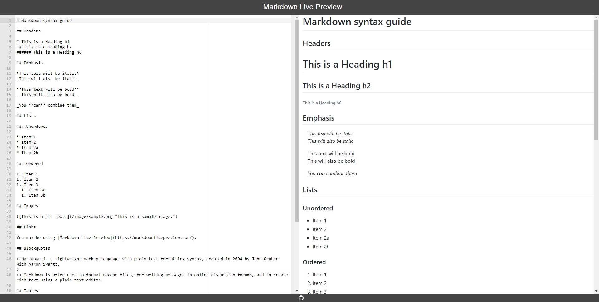

{: .no_toc}
# Lesson 1 - Learn Markdown

Markdown is an easy way to create formatted content... without worrying about the formatting specifics! In this section, you’ll learn a bit about Markdown and how to use it to create formatted text. Later, in [Lesson 3](lesson3), you'll also be using Markdown to create web pages.

<details markdown="block">
  <summary>
    Table of Contents
  </summary>
  {: .text-delta }
- TOC
{:toc}
</details>

## Lesson Objectives

- Learn about Markdown
- Practice creating web-ready content with Markdown
- Learn how to create special symbols and equations using HTML code

## Lesson Video

The following video demonstrates each of the steps outlined below in text.
<iframe height="416" width="100%" allowfullscreen frameborder=0 src="https://echo360.ca/media/a347ed63-745d-4d08-8b9a-98b2dd0d0e14/public?autoplay=false&automute=false"></iframe>
[View original here.](https://echo360.ca/media/a347ed63-745d-4d08-8b9a-98b2dd0d0e14/public)

## What is Markdown?

<!-- GitHub removed the Mastering Markdown page :(  -->
<!-- Borrowed shamelessly from GitHub's [Mastering Markdown](https://guides.github.com/features/mastering-Markdown/) page:

> Markdown is a way to style text on the web. You control the display of the document; formatting words as bold or italic, adding images, and creating lists are just a few of the things we can do with Markdown. Mostly, Markdown is just regular text with a few non-alphabetic characters thrown in, like # or \*. -->

Markdown is an easy way to style and format text. Rather than editing the document itself directly, you work with a plain text document (like something in Notepad!) You'd use characters like \* to specify whether words should be bold or italic, \# to specify headers, or a pattern of characters to signify images. 

Markdown uses simple notation to apply simple formatting rules. Since it's pretty much just plain text, it's transferable and much simpler than marked-up text like HTML or even Word or Google documents. It's also very readable in its plain text format, which is nice. For much of the writing that you do for the web, Markdown is good enough. GitHub uses Markdown for its documents (this web page was created in Markdown), as do a variety of other web platforms (Reddit and Trello, as examples).

You'll be using [**Markdown Live Preview**](https://markdownlivepreview.com/), an in-browser Markdown editor, for this lesson to create and display Markdown content. In Lesson 2, we'll be using GitHub to store and create Markdown files.

## Setting up Markdown Live Preview

- When you first go to [**Markdown Live Preview**](https://markdownlivepreview.com/), you'll see this page. We'll want to start from a blank page, so highlight all the text and delete it.

- On the left-hand side is the text editor. This is where you’ll be editing your Markdown file. On the right-hand side is the Markdown preview window. This is where Markdown Live Preview converts your Markdown file into our new fancy formatted text content!



{: .note }
> You may feel free to use any Markdown editor you're comfortable with. We recommend Markdown Live Preview because it best replicates the Markdown rules GitHub uses. 

## Using Markdown to create content!

Below, you'll be shown how to create different Markdown elements. Feel free to go to your Markdown Live Preview tab and follow along or test the elements out. While this workshop won't cover everything Markdown has to offer, you'll be provided with additional resources at the end of the lesson that covers more advanced Markdown elements.

### Paragraphs and New Lines

Just like in typical text editors, you can create regular text just by typing... well, text.

<div class="code-example" Markdown="1">

{: .label }
Input

```md
This is some text.
```

{: .label .label-green }
Output

This is some text.

</div>

However, one change in Markdown (compared to text editors like Google Docs or Microsoft Word) is the way you create new lines. If you simply start typing on the next line, the output will mash the two lines together onto the same line.

<div class="code-example" Markdown="1">

{: .label }
Input

```md
This is some text.
This is some text on a new line.
```

{: .label .label-green }
Output

This is some text.
This is some text on a new line.

</div>

There are three ways to seperate lines of texts.

1. Insert a blank line between your two paragraph. This creates two seperate paragraphs with spacing between them.
    <div class="code-example" Markdown="1">

   {: .label }
   Input

   ```md
   This is some text.

   This is some text on a new line.
   ```

   {: .label .label-green }
   Output

   This is some text.

   This is some text on a new line.

    </div>

2. End your paragraph with two spaces. This creates one paragraph, with a line break seperating them.
    <div class="code-example" Markdown="1">

   {: .note }
   Although this doesn't seem different compared to the first time we tried to create a new line, try highlighting the input! You'll notice that there are two spaces at the end of the first line.

   {: .label }
   Input

   ```md
   This is some text.  
   This is some text on a new line.
   ```

   {: .label .label-green }
   Output

   This is some text.  
    This is some text on a new line.

    </div>

3. Add a `<br>` HTML tag. This creates one paragraph, with a line break seperating them.
    <div class="code-example" Markdown="1">

   {: .label }
   Input

   ```md
   This is some text. <br>
   This is some text on a new line.
   ```

   {: .label .label-green }
   Output

   This is some text. <br>
   This is some text on a new line.

    </div>

### Headings

To create headings, simply add a `#` character. The number of `#` characters you have indicates the level of heading to use. There are 6 levels of headings.

<div class="code-example" Markdown="1">

{: .label }
Input

```md
# Header 1

## Header 2

### Header 3

#### Header 4

##### Header 5

###### Header 6
```

{: .label .label-green }
Output

{: .no_toc}
# Header 1
{: .no_toc}
## Header 2
{: .no_toc}
### Header 3
{: .no_toc}
#### Header 4
{: .no_toc}
##### Header 5
{: .no_toc}
###### Header 6
{: .no_toc}

</div>

### Text Emphasis

To create _italic_ text, we surround our text with the `*` character.

<div class="code-example" Markdown="1">

{: .label }
Input

```md
*Italic text*
```

{: .label .label-green }
Output

*Italic text*

</div>

To create **bold** text, we do the same thing but with two `**` characters.

<div class="code-example" Markdown="1">

{: .label }
Input

```md
**Bold text**
```

{: .label .label-green }
Output

**Bold text**

</div>

{: .new-title }

> Exercise
>
> In Markdown Live Preview, try creating ***bold italic text***.
>
> <details>
>   <summary> See Solution </summary>
>   <div markdown="1">
>   {: .note-title }                                   
> > Answer
> > 
> > To create bold italic text, simply surround the text with 3 `*` characters.
> >
> >   {: .label }
> >   Input
> >   ```md
> > ***Bold italic text***
> >   ```
> > 
> >   {: .label .label-green }
> >   Output
> > 
> >   ***Bold italic text***
> > 
>   </div>
> </details>

To create ~~strikethrough~~ text, surround the text with two `~` characters.

<div class="code-example" Markdown="1">

{: .label }
Input

```md
~~Strikethrough text~~
```

{: .label .label-green }
Output

~~Strikethrough text~~

</div>

{: .new-title }

> Exercise
>
> In Markdown Live Preview, try creating **~~bold strikethrough text~~**.
>
> <details>
>   <summary> See Solution </summary>
>   <div Markdown="1">
>   {: .note-title }                                   
> > Answer
> > 
> > To create bold strikethrough text, surround the text with 2 `~` characters, and then surround it with 2 `*` characters. Whether you do `~` first or `*` first doesn't matter.
> >
> >   {: .label }
> >   Input
> >   ```md
> > **~~Bold strikethrough text~~**
> > ~~**Bold strikethrough text**~~
> >   ```
> > 
> >   {: .label .label-green }
> >   Output
> > 
> > **~~Bold strikethrough text~~**
> >
> > ~~**Bold strikethrough text**~~
> > 
>   </div>
> </details>

### Lists

In Markdown, there are ordered lists and bulleted lists.

To make ordered lists, put `1.` before your lines.

<div class="code-example" Markdown="1">

{: .label }
Input

```md
1. My first item.
2. My second item.
    1. This is an indented item.
3. My third item.
```

{: .label .label-green }
Output

1. My first item.
2. My second item.
    1. This is an indented item.
3. My third item.

</div>

Similarly, to make bulleted lists, put a `-` character before your lines.

<div class="code-example" Markdown="1">

{: .label }
Input

```md
- This is an item.
- This is another item.
    - This is an indented item.
- This is some other item.
```

{: .label .label-green }
Output

- This is an item.
- This is another item.
    - This is an indented item.
- This is some other item.

</div>

{: .new-title }

> Exercise
>
> In Markdown Live Preview, try creating the list shown below.
>
> <div markdown="1">
>
> {: .label .label-green }
> Output
>
> 1. First item
> 2. Second item
>   - Sub-item 1
>   - Sub-item 2
> 3. Third item
>
> </div>
>
> <details>
>   <summary> See Solution </summary>
>   <div Markdown="1">
> 
>   {: .note-title }                                   
> > Answer
> >
> > {: .label }
> > Input
> >
> > ```md
> > 1. First item
> > 2. Second item
> >   - Sub-item 1
> >   - Sub-item 2
> > 3. Third item
> > ```
> > 
>   </div>
> </details>

### Links

To create links, we use the `[]()` syntax. The link goes inside the `()`, and the display text is given inside the `[]`.

<div class="code-example" Markdown="1">

{: .label }
Input

```md
[Link to this lesson page](https://scds.github.io/github-pages/lessons/lesson1.html)
```

{: .label .label-green }
Output

[Link to this lesson page](https://scds.github.io/github-pages/lessons/lesson1.html)

</div>

### Images

Creating images has the same syntax as creating links, with the exception that we include a `!` at the start. The text inside the `[]` will be the alternate text shown if the image fails to load. For the link, we can use either a web link to the image, or a relative path to an image stored locally. We'll show how to create an image from the web, and go over the relative path alternative in the following lesson.

<div class="code-example" Markdown="1">

{: .label }
Input

```md

```

{: .label .label-green }
Output


<a href="https://commons.wikimedia.org/wiki/File:Little_Penguin_Feb09.jpg">fir0002  flagstaffotos [at] gmail.com		Canon 5D II + Canon 400mm f/5.6 L</a>, <a href="http://www.gnu.org/licenses/old-licenses/fdl-1.2.html">GFDL 1.2</a>, via Wikimedia Commons

</div>

### Code Snippets

A really cool part of Markdown is its ability to showcase code! You've seen many of them in the previous sections, and now you'll learn how to create one yourself!

Surround your code with triple ```` ` ```` characters (it's normally found in the top left of your keyboard.) 

Additionally, you can write the code's programming language beside the first 3 ```` ` ```` characters to get colored syntax.

<div class="code-example" Markdown="1">

{: .label }
Input

````
```python
def add(x, y):
    z = x + y
    return z

print(add(5,2))
```
````

{: .label .label-green }
Output

```python
def add(x, y):
    z = x + y
    return z

print(add(5,2))
```

</div>

Alternatively, if you don't provide a language name, it'll output the same thing without the colored syntax.

<div class="code-example" Markdown="1">

{: .label }
Input

````
```
def add(x, y):
    z = x + y
    return z

print(add(5,2))
```
````

{: .label .label-green }
Output

```
def add(x, y):
    z = x + y
    return z

print(add(5,2))
```

</div>

<!-- 
Removed Emojis because Jekyll does not support them by default.
## Emojis

:grinning: -->

## [Optional] Adding scientific symbols and equations

While the simplicity of Markdown is usually an asset, there are times when you need to present text using more complex formatting--for example, when using symbols and equations. Given that these pieces aren't baked into Markdown, you'll need to resort to using HTML coding. This involves a bit more technical skill, but it's something that you can figure out pretty quickly with the help of Google.

### Symbols

The W3schools [HTML Symbols reference page](https://www.w3schools.com/html/html_symbols.asp) is the best place to go for comprehensive instruction on adding symbols using HTML. It also provides a variety of symbol lists for easy reference.

As discussed in the previous resource, you can use an _entity name_ or an _entity number_ to create a symbol. For example, to create the alpha symbol, you can do either of the following:

- Entering the _entity name_ `&alpha;` will print the symbol &alpha;, OR
- Entering the _entity number_ `&#945;` will print the symbol &alpha;

{: .note }
> Don't forget the semicolon at the end of the code!

<div class="code-example" Markdown="1">

{: .label }
Input

```md
&alpha; &#945;
```

{: .label .label-green }
Output

&alpha; &#945;

</div>

### Subscripts and superscripts

Subscripts and superscripts can be created by putting placing the following HTML tags before and after the desired numerals/symbols:

- For subscripts, place `<sub>` in front and `</sub>` after the character(s) you would like to subscript.

<div class="code-example" Markdown="1">

{: .label }
Input

```md
H<sub>2</sub>O
```

{: .label .label-green }
Output

H<sub>2</sub>O

</div>

- For superscripts, place `<sup>` in front and `</sup>` after the character(s) you would like to superscript.

<div class="code-example" Markdown="1">

{: .label }
Input

```md
&delta;<sup>18</sup>O
```

{: .label .label-green }
Output

&delta;<sup>18</sup>O

</div>

### Single-line equations

Single-line equations can be created by combining symbols and sub/superscripts as required.

<div class="code-example" Markdown="1">

{: .label }
Input

```md
h<sub>&theta;</sub>(x) = &theta;<sub>o</sub> x + &theta;<sub>1</sub>x
```

{: .label .label-green }
Output

h<sub>&theta;</sub>(x) = &theta;<sub>o</sub> x + &theta;<sub>1</sub>x

</div>

### More complex equations (in case you're interested)

If you require a more complex equation, it's probably easiest to insert the equation as an image. There are some interesting ways to do this dynamically using [LaTeX](https://www.latex-project.org/) if you're interested in exploring. You can find more information on these approaches in this [Stack Overflow answer](https://stackoverflow.com/a/47798853).

## Key Points / Summary

- Markdown is an easy way to format text and content.
- You can create paragraphs, headers, text emphasis, lists, links, images, code snippets, equations, and more using Markdown.
- The content of this website is made almost entirely in Markdown!

## Additional Resources

There is a lot more you can do with Markdown. This section will provide you with some additional resources that goes more in-depth with specific Markdown features, like tables, task lists, footnotes, and more!

- [markdownguide.org's Markdown Guide](https://www.markdownguide.org/getting-started/)
- [markdownguide.org's Basic Syntax Guide](https://www.markdownguide.org/basic-syntax/)
- [Adam Pritchard's Markdown Cheatsheet](https://github.com/adam-p/markdown-here/wiki/Markdown-Cheatsheet)
- [Daring Fireball's Markdown Introduction](https://daringfireball.net/projects/markdown/)
