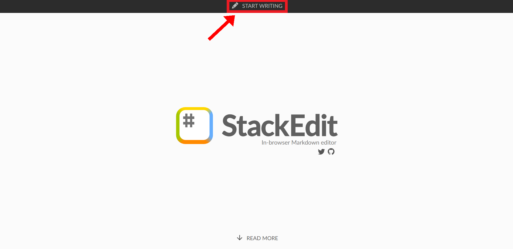
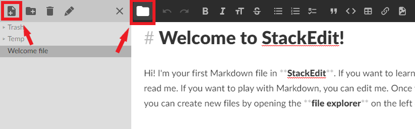

# Lesson 1: Learn Markdown 

Markdown is an easy way to format text without worrying about the formatting specifics, allowing you to focus on the content. You'll be using markdown to easily create our webpages later on in Lesson 3. In this section, you'll learn about markdown and how to use it to create formatted text.

## Lesson video
The following video demonstrates each of the steps outlined below in text:
<iframe height="416" width="100%" allowfullscreen frameborder=0 src="https://echo360.ca/media/ba194214-c372-4df6-b74d-2cdf8157f996/public?autoplay=false&automute=false"></iframe>

## Lesson objectives 
- Learn about Markdown
- Practice creating web-ready content with Markdown
- Learn how to create special symbols and equations using HTML code 

## What is Markdown? 
Borrowed shamelessly from GitHub's [Mastering Markdown](https://guides.github.com/features/mastering-markdown/) page: 
> Markdown is a way to style text on the web. You control the display of the document; formatting words as bold or italic, adding images, and creating lists are just a few of the things we can do with Markdown. Mostly, Markdown is just regular text with a few non-alphabetic characters thrown in, like # or *.

Markdown uses simple notation to apply simple formatting rules. Since it's pretty much just plain text, it's transferrable and much simpler than marked-up text like HTML or even Word or Google documents. It's also very readable in its plain text format, which is nice. For much of the writing that you do for the web, Markdown is good enough. GitHub uses Markdown for its documents (this document was created in markdown), as does a variety of other web platforms (Reddit and Trello, as examples). 

You'll be using [**StackEdit**](https://stackedit.io/), an in-browser markdown editor, for this lesson to create and display markdown content. In Lesson 2, we'll be using GitHub to store and create markdown files.

## Setting up Stack Edit

When you first go to [**StackEdit**](https://stackedit.io/), you'll see this page. Click the "Start Writing" button at the top of the page. 



If this is your first time using StackEdit, you will see a lot of pre-generated content. For this workshop, you'll want to go to the top left "Toggle Explorer" button, and create a new file. You can name the file anything you'd like. After creating your new file, close the file explorer by clicking on the "Toggle Explorer" button or the "Close Explorer" button, and then delete any pre-generated content.



On the left hand side is the text editor. This is where you'll be editing your markdown file. On the right hand side is the markdown preview window. This is where StackEdit converts your markdown file into our new fancy formatted text content!

## Using Markdown to create content!

Below, you'll be shown how to create different markdown elements. Feel free to go to your StackEdit tab and follow along or test the elements out. While this workshop won't cover everything Markdown has to offer, you'll be provided with additional resources at the end of the lesson that covers more advanced markdown elements.

### Paragraphs and New Lines

Just like in typical text editors, you can create regular text just by typing... well, text.

<div class="code-example" markdown="1">

{: .label }
Input
```md
This is some text.
```

{: .label .label-green }
Output

This is some text.

</div>

However, one change in Markdown is the way you create new lines. If you simply start typing on the next page, the output will mash the two lines together onto the same line.

<div class="code-example" markdown="1">

{: .label }
Input
```md
This is some text.
This is some text on a new line.
```

{: .label .label-green }
Output

This is some text.
This is some text on a new line.

</div>

There are three ways to seperate lines of texts.

1. Insert a blank line between your two paragraph. This creates two seperate paragraphs with spacing between them.
    <div class="code-example" markdown="1">

    {: .label }
    Input
    ```md
   This is some text.

   This is some text on a new line.
    ```

    {: .label .label-green }
    Output

    This is some text.

    This is some text on a new line.

    </div>

2. End your paragraph with two spaces. This creates one paragraph, with a line break seperating them.
    <div class="code-example" markdown="1">

    {: .note }
    Although this doesn't seem different compared to the first time we tried to create a new line, try highlighting the input! You'll notice that there are two spaces at the end of the first line.

    {: .label }
    Input
    ```md
   This is some text.  
   This is some text on a new line.
    ```

    {: .label .label-green }
    Output

    This is some text.  
    This is some text on a new line.

    </div>

3. Add a ```<br>``` HTML tag. This creates one paragraph, with a line break seperating them.
    <div class="code-example" markdown="1">

    {: .label }
    Input
    ```md
   This is some text. <br>
   This is some text on a new line.
    ```

    {: .label .label-green }
    Output

    This is some text. <br>
    This is some text on a new line.

    </div>

### Headings

### Text Emphasis

### Lists

### Links

### Code Snippets

### Images

### Emojis

 the [Mastering Markdown guide](https://guides.github.com/features/mastering-markdown/) and/or [markdownguide.org's Basic Syntax Guide](https://www.markdownguide.org/basic-syntax/) (or other guides you find on the web) as a reference, enter text beneath the front matter to create a fictional document that contains most of the following elements: 
- Headings of a number of different levels
- bolded, italicized text 
- insert an image from the web
- insert the image that you uploaded to the ```images``` folder in this repository
- An ordered list
- A bulleted list
- A link to another website
- A snippet of code
- A table
- And finally, an emoji! (you can use the [Markdown Emoji cheat sheet](https://github.com/ikatyang/emoji-cheat-sheet/blob/master/README.md) as a reference)

### Some Notes
- Use the **Preview changes** tab to see (mostly) how it will look on your page. 
- Markdown doesn't add new lines to a document in the same way as a document editors like MS Word. Sometimes you might hit enter to start a new line in the editor, only to find that it has been added to the first paragraph when rendered. To avoid this you can try one of the following: 
  - Enter an extra blank line
  - Leave two blank spaces at the end of the sentence (this is interpretted as the end of a paragraph)
  - Insert the HTML tag ```<br>``` to create a break line in the rendered text. You can use multiple break tags to create more blank lines.  
<br>
**Commit your changes** and enjoy the products of your hard work!

## 4. Create a second markdown page
The website you make in the next lesson will have two pages. Here, you are going to create the second page. 
- In the top level of your repository (remember, you can click the ```<> Code``` tab to get there), create a new markdown file. Name it as you wish, but ensure that it is free of spaces and special characters and ends in ```.md``` (e.g. ```pagetwo.md``` works just fine). 
- As done earlier, add front matter with a title. Set the ```nav_order``` value to 2 (this will inform GitHub Pages to make this the second menu item in your website), as shown below: 
```
---
title: <enter a different title here>
layout: default
nav_order: 2
---
```
- Add a few sentences and **commit your changes**.

## 5. [Optional] Adding scientific symbols and equations
While the simplicity of Markdown is usually an asset, there are times when you need to present text using more complex formatting--for example, when using symbols and equations. Given that these pieces aren't baked into Markdown, you'll need to resort to using HTML coding. This involves a bit more technical skill, but it's something that you can figure out pretty quickly with the help of Google. 

### Symbols
The W3schools [HTML Symbols reference page](https://www.w3schools.com/html/html_symbols.asp) is the best place to go for comprehensive instruction on adding symbols using HTML. It also provides a variety of symbol lists for easy reference.

As discussed in the previous resource, you can use an *entity name* or an *entity number* to create a symbol. For example, to create the alpha symbol, you can do either of the following: 
- Entering the *entity name* ```&alpha;``` will print the symbol &alpha;, OR
- Entering the *entity number* ```&#945;``` will print the symbol &alpha;  

**Note**: Don't forget the semicolon at the end of the code!

### Subscripts and superscripts
Subscripts and superscripts can be created by putting placing the following HTML tags before and after the desired numerals/symbols: 
- For subscripts, place ```<sub>``` in front and ```</sub>``` after the character(s) you would like to subscript.
  - e.g. ```H<sub>2</sub>O``` produces H<sub>2</sub>O
- For superscripts, place ```<sup>``` in front and ```</sup>``` after the character(s) you would like to superscript.
  - e.g. ```&delta;<sup>18</sup>O``` produces &delta;<sup>18</sup>O

### Single-line equations  
Single-line equations can be created by combining symbols and sub/superscripts as required. 
- e.g. ```h<sub>&theta;</sub>(x) = &theta;<sub>o</sub> x + &theta;<sub>1</sub>x``` produces h<sub>&theta;</sub>(x) = &theta;<sub>o</sub> x + &theta;<sub>1</sub>x

### Create some symbols/equations
- Open your second markdown page for editing, and write a few symbols and an equation or two. 
- **Commit your changes**

### More complex equations (in case you're interested)
If you require a more complex equation, it's probably easiest to insert the equation as an image. There are some interesting ways to do this dynamically using [Latex](https://www.latex-project.org/) if you're interested in exploring. You can find more information on these approaches in this [Stack Overflow answer](https://stackoverflow.com/a/47798853).

<div style="display: flex;">
<div style="flex-grow: 1;" markdown="1">
[🡨 Lessons](../lessonsPage){: .btn .btn-outline} 
</div>

<div markdown="1">
[Lesson 2 🡪](lesson2){: .btn .btn-outline}
</div>
</div>