{:.no_toc}
# Lesson 2: Learn GitHub
In this second lesson, you'll get some introductory experience creating a GitHub repository and populating it with files from the web interface. 

<details markdown="block">
  <summary>
    Table of Contents
  </summary>
  {: .text-delta }
- TOC
{:toc}
</details>

## Lesson objectives 
- Create a GitHub repository.
- Explore the version control features of GitHub.
- Create folders and files.
- Create and edit a markdown file.

<!-- ## Lesson video
The following video demonstrates each of the steps outlined below in text:
<iframe height="416" width="100%" allowfullscreen frameborder=0 src="https://echo360.ca/media/db64dd93-a736-4936-9517-8d0a18c16a3e/public?autoplay=false&automute=false"></iframe> -->

## Create a new GitHub repository
A repository is a container for related materials (i.e. folders and files), that allows for them to be managed (stored, version-tracked) and shared together. Usually, you create a separate repository for each project that you are working on. [Here are the New York Times' GitHub repositories](https://github.com/nytimes), for example.

- Ensure you have [created a GitHub account](../preparation#1-create-a-github-account) and are logged in.
- From your [GitHub main page](https://www.github.com), click on the green `New` button at the top left of the page. This will be the repository (storage location) where the content of your website will be hosted. 

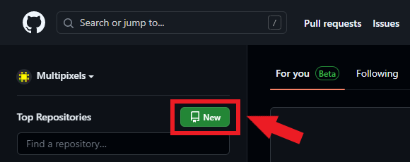

- Provide a name for your repository. The name you enter will determine the URL of your repository.
  - There are some characters that are not allowed in your repository name, such as spaces and certain symbols.
  - The repository URL will take the form: ```https://github.com/<your-github-username>/<your-repo-name>```
	- e.g. ```https://github.com/Multipixels/github-pages-workshop```
  - Optionally, you can also include a small description about your new repository.
    - This description will be shown on your repository page and other GitHub pages.
- Set your repository visibility to public. 
  - If you have a free GitHub account, you can only create a GitHub Pages website in a public repository. You can read more about it [here](https://docs.github.com/en/pages/getting-started-with-github-pages/about-github-pages).
- Check the box to **Initialize this repository with a README**
  - Your README file is a plain text file (same as a .txt file) that typically contains descriptive information about your repository (Who made it? What does it contain? What is it for?, etc.). The ```.md``` extension indicates to GitHub that this is a Markdown file (sounds familiar!) One of the nice features of markdown files is that they are readable by almost any applications (and humans), since they are mostly just plain text files.

- Click the **Create repository** button

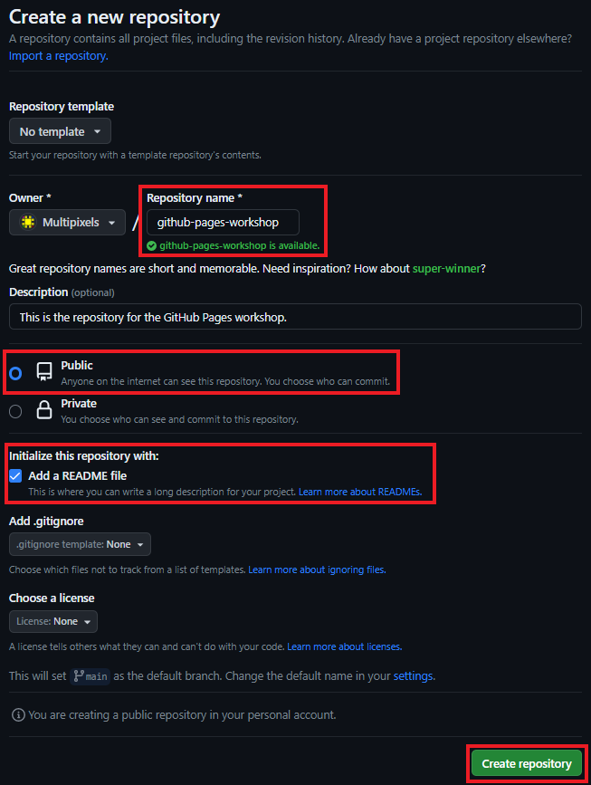

## The GitHub repository menu
You should now see the top-level of your GitHub repository. This section will go through any important areas of this page.

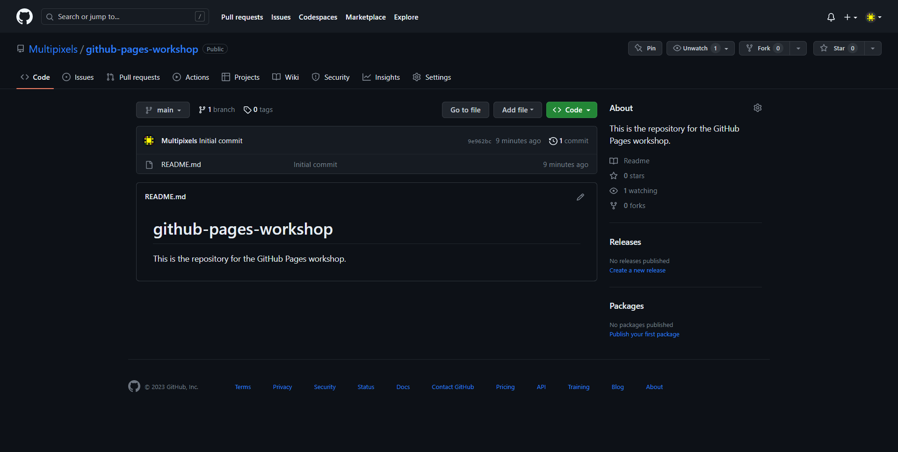

{:.no_toc}
### File Explorer

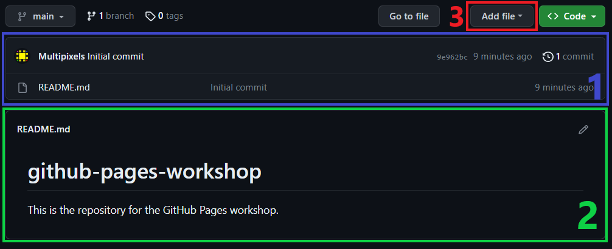

- In the blue rectangle, you see your file explorer. This is where your repository's directories and files will be found. A new repository will typically contain a README.md file. As previously mentioned, the `.md` extension indicates that this is a Markdown file.

- In the green rectangle, GitHub renders the README.md file in the current directory (if there is one). Since README is a Markdown file, you can include all the fancy features you learned from the previous lesson. 

- You'll be able to create or upload files using the "Add file" button in the red rectangle.

{:.no_toc}
### Repository Statistics

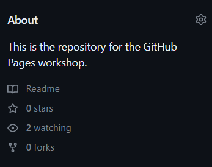

- At the very top, you'll be able to find the description you created for your repository (if you made one.) Clicking on the gear icon allows you to change the description, as well as attach a website address and topics. The website and topics will be shown under the description.

- The Readme button takes you to the same page you're currently on. Below that, you'll find stats for number of stars, number of "watches", and number of forks.
	- Stars are GitHub's version of "likes." When users like a repository project, they can "Star" it.
    - When a user decides to "Watch" a repository, they'll receive notifications about any activities or changes within the repository.
    - When a user wants to copy the repo, either to modify it for self-use or to make contributions to the original repository, they "Fork" it. Forking a repository duplicates the contents of the repo, letting the user make changes to the repo without disrupting the original repository.

{:.no_toc}
### Repository Header Menu

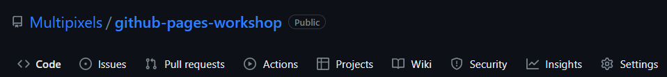

- At the top of the repository header, we have our repository file path. It will always start with the owner of repository, (in your case this would be your GitHub username), followed by the name of the repository, and then any directories you're inside of.

- Below are a bunch of menus! The two most important ones are the `<> Code` menu, and the `Settings` menu. The menu you're currently in is the `<> Code` menu, and you can probably guess, this is where all your code (and files, documents, data, etc.) go. 

{: .note }
> If you ever want to return to the top-level of your repository, you can either click the `<> Code` menu button, or click on the name of your repository in the repository file path.

## Add files and folders
In this section, you'll create a file and folder in your repository and upload a file from your computer to your new folder. You will eventually use all of these items to create your first webpage with GitHub Pages.

### Create a file 
- In the top-level repository page, click ```Add file > Create new file```.
- Where prompted to name your file, title it ```index.md```. This creates an empty text file that GitHub will assume contains Markdown code.

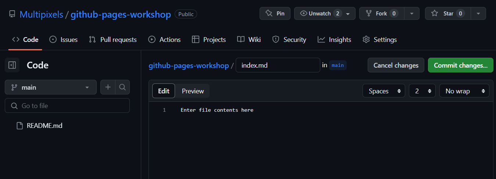

- Press the green `Commit changes...` button. Add a short description (or use the suggested one) and click ```Commit change```.
  - There are two comment boxes that can be filled in when committing changes. The short description **is required**--ideally, it contains a brief message about the changes you made to the file. An optional larger description box can be filled out, as well. 

{: .warning }
> Unlike programs such as Google Docs, GitHub does not save your changes automatically. Rather, you have to instruct it to **Commit** (save) the changes, which takes a snapshot of the file and saves it as the newest version.   
  
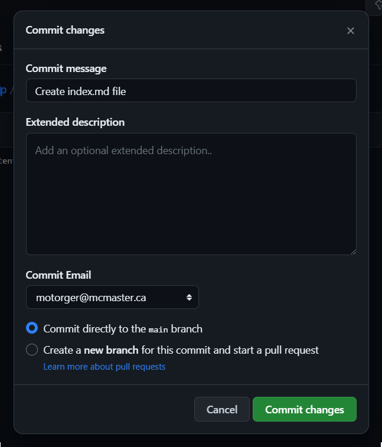

- After creating your new file, return to the top-level of your repository.

### Edit your text file

- Click on your ```index.html``` file to view it, and then click the edit button (pencil icon at the top right) to switch to editing mode

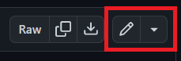

- Add a bit of text to this file. Take this opportunity to try out some of the Markdown features you learned in the previous lesson. Use the `Preview` button at the top left of the editor to preview how the file will render.

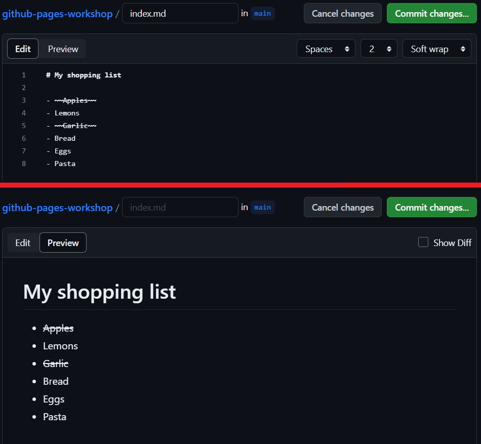

- When finished editing, **commit your changes** and go back to the top-level of your repository. 

### View your changes and change history
- While viewing your ```index.md``` file, explore the ```Blame``` and ```History``` menus to better understand how GitHub keeps track of and visualizes file changes. 

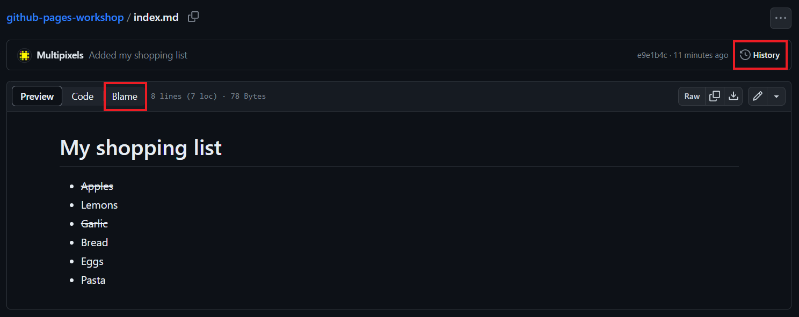

{:.no_toc}
##### File Blame Menu

The blame menu examines a file's contents line by line and shows when that line was last modified and who modified it last.
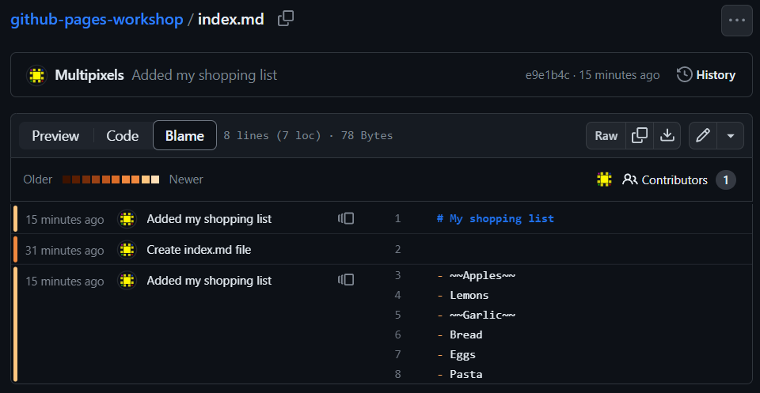

{:.no_toc}
##### File History Menu

The history menu shows all commits that changed the selected file.
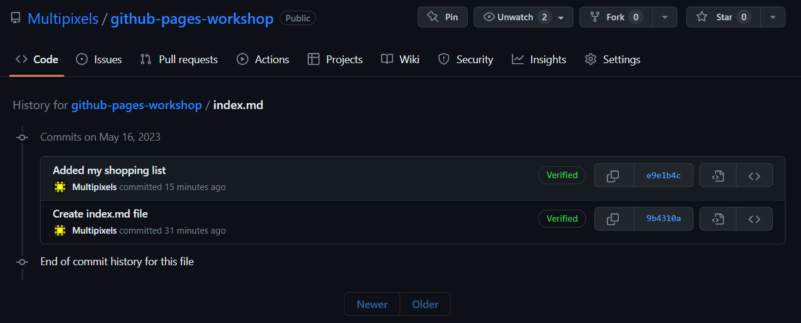

### Create a directory 

One of GitHub's quirks is that it does not allow you to create empty directories. If you want to create a new directory, you have to create a new file and tell GitHub that the new file will be located in a new directory. We'll go through the process of creating a `images` folder.
- Go back to the top-level of your repository.
- Click ```Add file > Create new file```
- When prompted to name your file, enter ```images/temp.txt```. **Commit your changes**. This will create a directory called ```images``` and an empty file inside of it called ```temp.txt``` (which can be deleted later, once you've moved or created other files into the images folder).

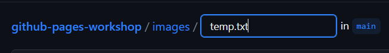

### Upload a file 
- Make sure you are located within the ```images``` folder (you should see your ```temp.txt``` file). 
- Click ```Add file > Upload files```. 
- Select an image from your computer to upload. If you want to download something from the web, try to use something that is not copyrighted or is royalty free ([e.g.](https://www.pexels.com/royalty-free-images/))
- **Commit your changes**

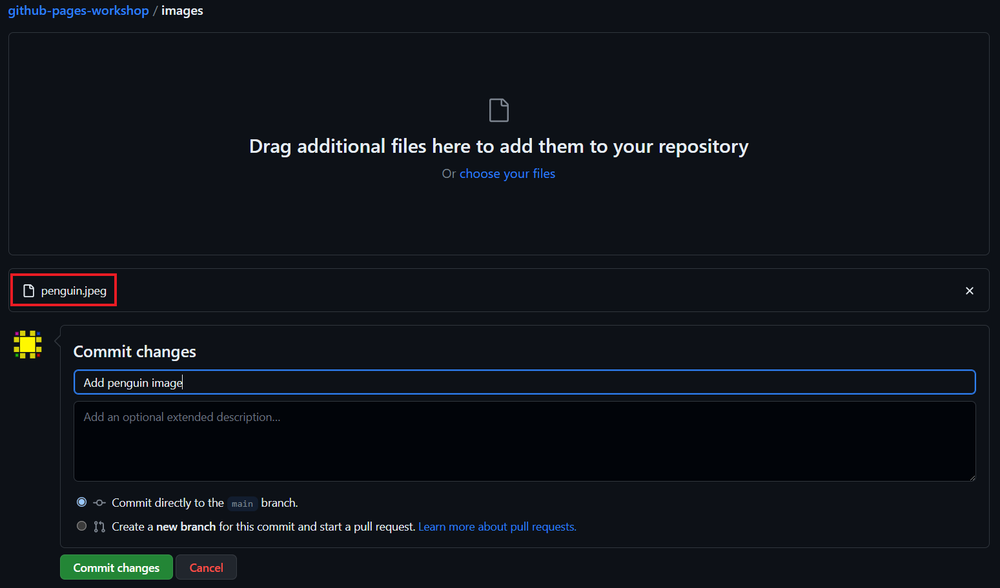

### Remove a file

Let's take this chance to remove the temporary text file we created in the `images` folder. Since we have an image there, it should be safe to remove.

- Go to your temporary text file in the `images` folder.
- Click on the `...` button at the top right, and click `Delete file`.
- **Commit** the deletion.

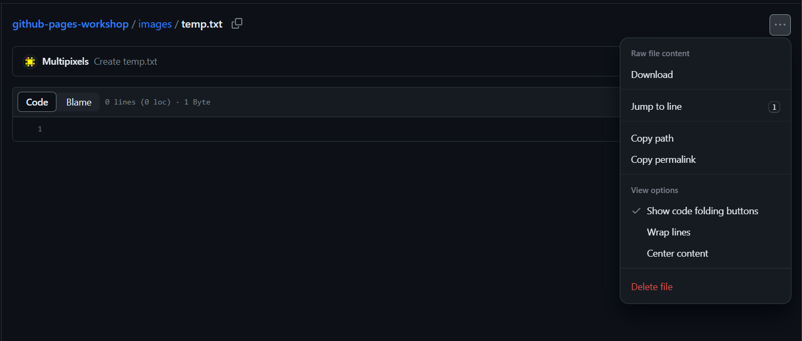

## Key Points / Summary
- A repository is a collection of related files with the ability to version control.
- You can create, edit, and upload files, view file version history, and create new directories in GitHub. 
- You have to commit changes to files to save a new version of them.

<div style="display: flex;">
<div style="flex-grow: 1;" markdown="1">
[🡨 Lesson 1](lesson1){: .btn .btn-outline} 
</div>

<div markdown="1">
[Lesson 3 🡪](lesson3){: .btn .btn-outline}
</div>
</div>