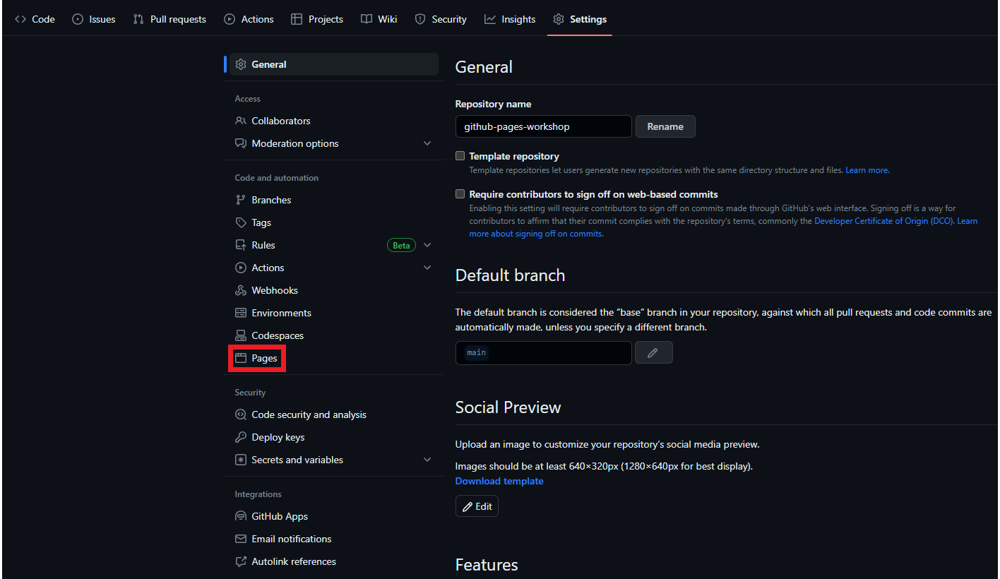
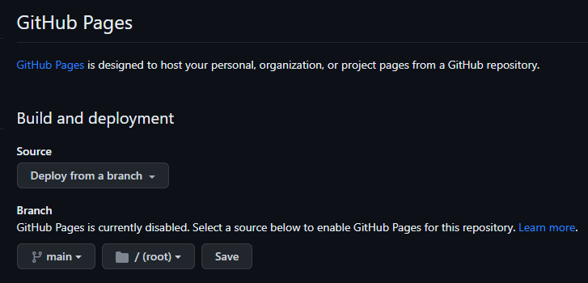
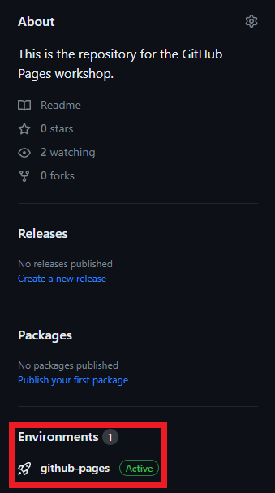
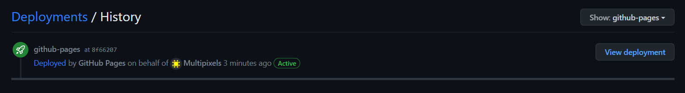
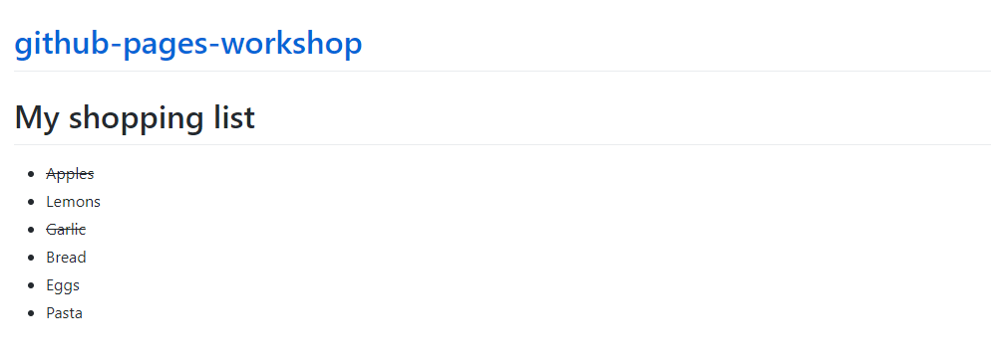
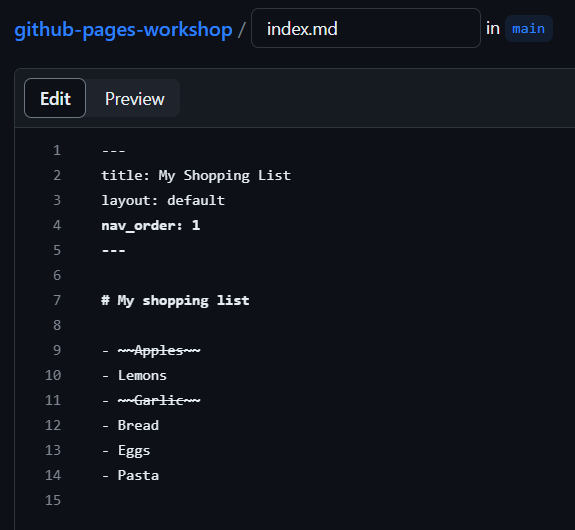
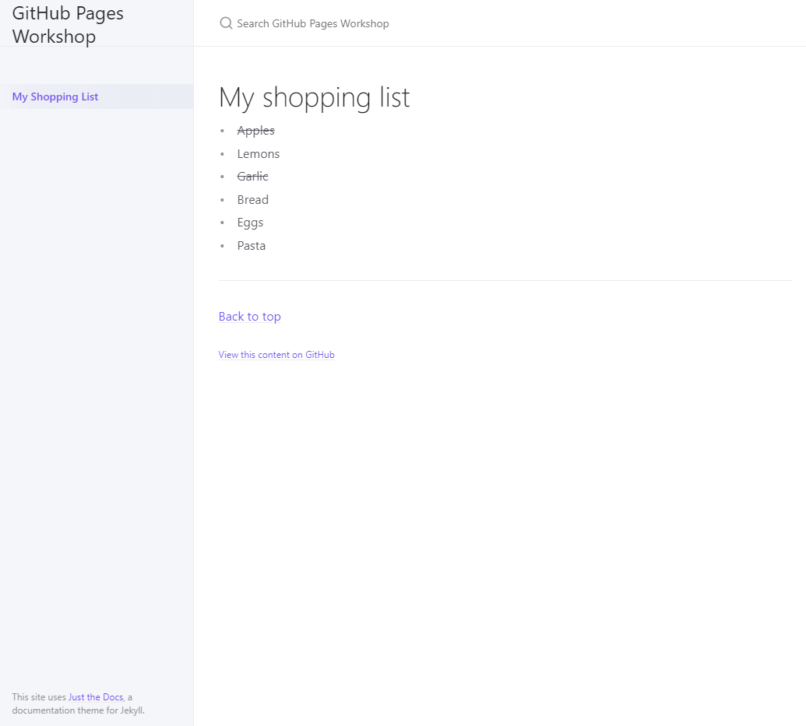

{: .no_toc}
# Lesson 3: Create web pages with GitHub Pages
In this lesson, you'll learn how to use GitHub Pages to turn the markdown files in your GitHub repository into a functioning webpage.

<details markdown="block">
  <summary>
    Table of Contents
  </summary>
  {: .text-delta }
- TOC
{:toc}
</details>

## Lesson Objectives
- Create a webpage from Markdown files using GitHub Pages & jekyll
- Customize your web pages; create a website
- Embed multimedia content

## Lesson Video

The following video demonstrates each of the steps outlined below in text.
<iframe height="416" width="100%" allowfullscreen frameborder=0 src="https://echo360.ca/media/caae67c0-d1d8-4565-88fd-ce1fbc59efb1/public?autoplay=false&automute=false"></iframe>
[View original here.](https://echo360.ca/media/caae67c0-d1d8-4565-88fd-ce1fbc59efb1/public)

## Set up GitHub Pages
In this step, you will explore some of the functionality available in a GitHub repository, which includes GitHub Pages. 
- Ensure that you've created an `index.md` file as outlined in [Lesson 2](lesson2).
- Go to ```Settings``` and look for the `Pages` button on the left hand side.



- For the **Source**, ensure it is set to `Deploy from a branch`. 
- For the **Branch**, select the `main` branch and select the root folder. Make sure to press `Save`!
    - This tells GitHub to make our website with the files from the top-level of our repository.



- Congratulations, in just a moment, your website will be ready! While GitHub is creating your website, return to the top-level of your repository.
- A new `Environments` section should appear soon on the right hand side. If it isn't there yet, wait a few more moments and refresh the page. When it appears, click on `github-pages`.



- This will bring you to the Deployment History menu. If your website is ready, click on `View Deployment` to see your website. Otherwise, wait a few more moments and refresh the page.



{: .note }
> You may receive a 404 error, but after a minute, your website will appear with the content from index.md as the landing page.
>
> By default, GitHub Pages expects at least one file in the root folder named `index.html`. Jekyll, however, lets us also use `index.md`. This file (either `index.html` or `index.md`) becomes the homepage for the web page.

- Your page will look rather basic (it may look different depending on what you put in your index.md). This is because we haven't provided GitHub with a Jekyll theme for our content. In the next section, we'll take a look at Jekyll, the different themes available to us, and how to set it up.



<!-- - Click through the various top-level tabs in the repository to explore the features that are available

  - ```Issues``` allow you, collaborators, and external users to report problems with your code and suggest changes
  - ```Pull requests``` lists any requests from external users to merge their code into yours to provide new functionality
  - ```Actions``` allow you to run automate processes from within your GitHub repository
  - ```Projects``` is a Trello-like task planner 
  - ```Wiki``` is a wiki for yourself and collaborators
  - ```Security``` lets you configure security features for your repository and code
  - ```Insights``` shows stats on contributions, viewership, and use of your repository
  - ```Settings``` allows you to configure a variety of other features within your repository
- Open the ```Settings``` Tab. Briefly explore the various options on the side panel. -->

## What is Jekyll?


[**Jekyll**](https://jekyllrb.com/) is a simple static website generator. In other words, Jekyll is what allows you to turn your Markdown files into a website. GitHub Pages comes with built-in Jekyll support, meaning that there is no need to ever download Jekyll.

With Jekyll, we can specify a theme we want to use for our website. There are thousands upon thousands of themes available, so take this opportunity to browse any of the following resources for something you like. 

- [jamstackthemes.dev](https://jamstackthemes.dev/ssg/jekyll/)
- [jekyllthemes.org](http://jekyllthemes.org/)
- [jekyllthemes.io](https://jekyllthemes.io/)
- [jekyll-themes.com](https://jekyll-themes.com/)

{: .warning }
> Take note that some themes may have additional steps or prerequisites for usage. Make sure to read the documentation guidelines given.

This workshop's website (the one you're on right now!) is built using a modified version of the [Just the Docs](https://just-the-docs.com/) Jekyll theme. For the rest of the lesson, we will use the Just the Docs theme to showcase how a theme can be applied to a website.

## Setting up our website for Jekyll and Just the Docs

To apply our theme, we have to create a new file called `_config.yml` in the top-level of our repository.

- Navigate back to the top-level and create a file called `_config.yml`. Don't commit just yet.

This is your configuration file, and it's written in a language called [YAML](https://en.wikipedia.org/wiki/YAML) (it stands for Yet Another Markup Language. it's similar to Markdown). The `_config.yml` file provides instructions to Jekyll about how to build your website. Jekyll's config has a set of pre-defined properties, but themes can have their own properties as well (this is why it's important to read the theme's documentation!)

{: .note }
> Typically, Jekyll ignores files that start with an underscore. This can be used to hide pages from the user.
> 
> However, there are some special files that Jekyll looks for, also represented by underscores. `_config.yml` is one of these special files.

There is ***a lot*** that you can do with Jekyll (within GitHub Pages and as a standalone application on your computer) to generate customized webpages. While only the theme information is set in your file initially, there are many ways that you can [customize it](https://docs.github.com/en/pages/setting-up-a-github-pages-site-with-jekyll/about-github-pages-and-jekyll#plugins). Here, we'll add a few changes to improve your website's functionality and appearance:

- Set the contents of the ```_config.yml``` file with the text below (by copying and pasting).
- Edit any of the fields to correspond with your own information.

```yaml
title: <your web page title> # EDIT: Fill this in
description: <description of your web page> # EDIT: Fill this in

remote_theme: just-the-docs/just-the-docs # Borrowing the theme from https://github.com/pmarsceill/just-the-docs
github_repo_url: "https://github.com/<YOUR_USERNAME>/<YOUR_REPO_NAME>" # EDIT: REPLACE WITH THE URL TO YOUR WEBPAGE

# Heading anchor links appear on hover over h1-h6 tags in page content
# allowing users to deep link to a particular heading on a page. (true or false)
heading_anchors: true

# Activate a "Back to top" link
back_to_top: true
back_to_top_text: "Back to top"

# A footer with "Edit this page on GitHub" link text
gh_edit_link: true # show or hide edit this page link
gh_edit_link_text: "View this content on GitHub"
gh_edit_repository: "https://github.com/<YOUR_USERNAME>/<YOUR_REPO_NAME>" # EDIT: ADD THE URL TO YOUR GITHUB REPO
gh_edit_branch: "master" # the branch that your docs is served from
# gh_edit_source: docs # the source that your files originate from
gh_edit_view_mode: "tree" # "tree" or "edit" if you want the user to jump into the editor immediately

# Include plugins for relative links and a remote theme
plugins:
  - jekyll-relative-links
  - jekyll-remote-theme
```

{: .note }
> The function of each line is explained in comments (i.e. any text on a line that comes after a `#` symbol.) 
>
> Look through the document and update any of the fields with the necessary information.

- **Commit** your changes!

When you're done with that, go back to the top-level of your repository and edit your `index.md` file. Jekyll will only process Markdown files that contain front matter text. Front matter shows up at the top of your Markdown file and it tells Jekyll how to process that file.

- Include the text below at the top of your index.md file (include the dashes!)
- Edit any of the fields to correspond with your own information and then **commit** your changes. An example is provided below.
    - The `nav_order` is the numerical value assigned to your page. It's used when ordering your pages in the navigation menu for the Just the Docs theme. `nav_order` 1 means it'll be the first item in the list. If you add a new page, you can set it to 2 to be the second item in the list, and so on.

```yaml
---
title: <enter your title here> 
layout: default
nav_order: 1
---
```



If all went well, your website should now be using the Just the Docs template!



## Creating a new page with embedded multimedia content

Creating new pages from here on is very quick and simple.

- Go back to the top-level of your repository. 
- Create a new Markdown file, and copy the front matter at the top.
    - Don't forget to update the `nav_order`!

Anything after the front matter is Markdown, just like usual. Below, you'll see a piece of embed code. This is embed code provided by YouTube, allowing us to embed a video right into our website. To get the embed code of any video on YouTube, read [this](https://support.google.com/youtube/answer/171780?hl=en) guide by YouTube. You can also use embed code from other media sites. Otherwise, feel free to use the embed code provided below. 

- Copy the embed code into your new Markdown file. Feel free to include any other Markdown elements you'd like.
- **Commit** and save your file when you're done.

```md
<iframe width="800" height="500" src="https://www.youtube.com/embed/dQw4w9WgXcQ" frameborder="0" allow="accelerometer; autoplay; clipboard-write; encrypted-media; gyroscope; picture-in-picture" allowfullscreen></iframe>
```

## Key Points / Summary
- GitHub Pages, combined with Jekyll, provides an easy way to create webpages quickly using Markdown.
- There are many Jekyll themes available.
- You can embed videos into your webpages.
