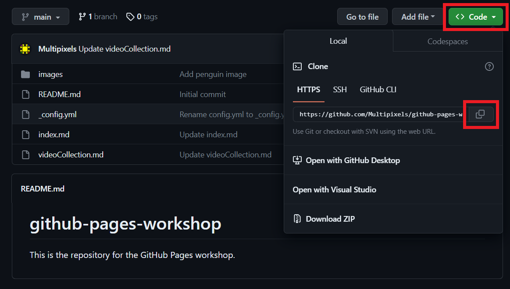
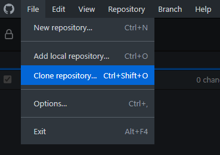
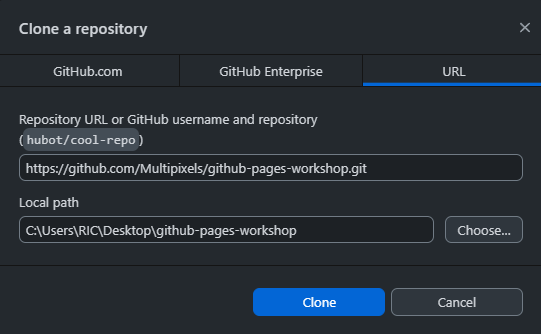
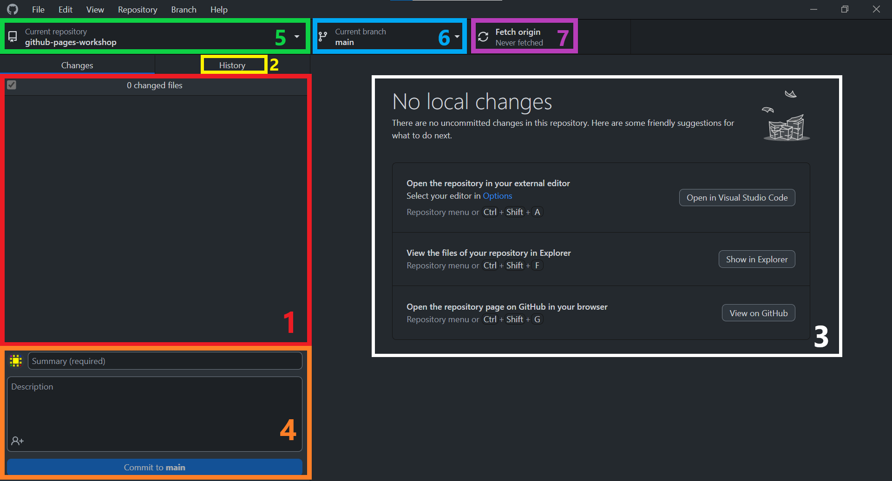
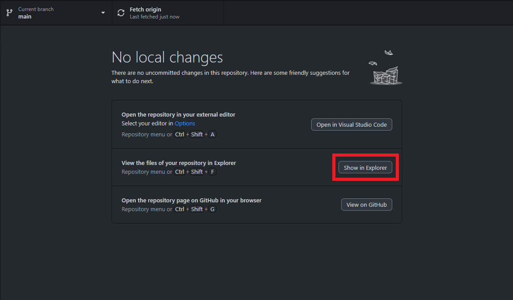

{: .no_toc}
# Lesson 4 - Sync with GitHub Desktop
In this lesson, you will use GitHub Desktop to interact with your repository using your local file system. Ensure that you've sucessfully installed [GitHub Desktop](preparation#2-install-github-desktop).

<details markdown="block">
  <summary>
    Table of Contents
  </summary>
  {: .text-delta }
- TOC
{:toc}
</details>


{: .warning }
> GitHub doesn't currently support GitHub Desktop for **Linux** users. You will still be able to learn about Markdown, GitHub, and GitHub Pages without using GitHub Desktop. If you'd like to learn how to use GitHub with local development, feel free to attend our other workshop on git [**here**](https://scds.github.io/dash-webinars/vcgit.html).

## Lesson objectives 
- Clone your GitHub repository to your local machine
- Use GitHub Desktop to control file versions on your local computer
- Push changes up to GitHub (and pull new changes back down)

<!-- ## Lesson video
The following video demonstrates each of the steps outlined below in text:
<iframe height="416" width="100%" allowfullscreen frameborder=0 src="https://echo360.ca/media/99e82d8b-81a2-485e-afc6-236bd169c898/public?autoplay=false&automute=false"></iframe> -->

<!-- [**Go to GitHub Desktop Instructions**](#github-desktop)  |  [**Go to git Instructions**](#git) -->

## What's the point of GitHub Desktop?

You might have found it tedious to create or upload files in GitHub, especially since you have to do it one by one! With GitHub Desktop, you'll be able to work with the files in your repository as if it were just a folder on your desktop. You'll also be able to commit changes to multiple files within the same commit.

## Clone your repository to your computer
In this step, you will clone your existing GitHub repository to your local computer so that you can work on files locally.

{: .no_toc}
### In GitHub
- In the top-level of your GitHub repository click the green ```<> Code``` button.
- Copy the https code (e.g. ```https://github.com/Multipixels/github-pages-workshop.git```)  



{: .no_toc}
### In GitHub Desktop

{: .warning }
Make sure you've followed the steps outlined in [Preperation](../preparation) to set up GitHub Desktop.

- Go to ```File > Clone repository```.



- Select to add by ```URL``` and paste the copied URL to your GitHub repository.
- Choose a folder on your local computer where you want to download the repository contents--a new folder will be created with the name of the repository. 
- Click ```Clone```.
  - **NOTE**: You can also use this approach to clone someone else's GitHub repository!



## The GitHub Desktop Interface

We will quickly go over the different elements in the GitHub Desktop interface.



On this page, we can see all the changes we've made to the repository files since the last commit. (Since this is a freshly cloned repository, there are no changes to show.) Clicking on the history button will show you the history of all the commits in the repository, much like how GitHub does.

When you do make changes, they'll be highlighted on the right side. Then, you'll be able to commit your changes by providing a commit summary (with an optional description,) just like in the GitHub interface.

At the top left, you can see a list of all your cloned repositories on your computer and select which one you want to work on. To the right of that, you can select what branch you're working on. To the right of that, this is where you *pull* and *push* your changes.

Currently, you have a local repository (GitHub Desktop) and a remote repository (GitHub).

Pull: GitHub Desktop will sync with GitHub by downloading any changes made to the remote repository.

Push: GitHub Desktop will sync with GitHub by uploading any changes made to the local repository.

The typical workflow is to **pull** all changes **before** starting to work on your project, make your changes, **commit** your changes, and then **push** your work to GitHub. Doing this correctly will prevent any version conflicts of files.

## Make some changes on your local repository

- Of course, before making changes, we want to pull.
    - To pull, click on the "Fetch Origin" button at the top. If there's any changes to pull, it'll now say "Pull Origin". If it says that, click on it again to pull the changes. Otherwise, continue to the next step.
- Click on the `Show in Explorer` button (or use the `Ctrl` + `Shift` + `F` shortcut) to open up your file explorer.



- Edit or create a Markdown file. 
- Make any other changes you'd like to see appear on your website.

## Commit new changes
- In GitHub Desktop, you should be shown the files that have been changed, and be able to view the specific changes. 
- If you are comfortable with the changes, you are ready to commit them.
  - Provide a summary of the changes (or used the suggested text), and lengthier description, if desired.
  - Click ```Commit to main```. This commits your changes to your local repository (but not yet to your GitHub one!). 
  - If you continue to work on your local files, you will need to again commit changes.  

## Push changes to your GitHub remote repository
In this step, you'll *push* your local changes back up to your GitHub repository, so that both are synced. 
- In GitHub Desktop, click the ```Push origin``` button to send your changes to your GitHub repository.
- You can go back to your repository on GitHub to verify your changes.

## Make changes in the GitHub remote repository

To demonstrate how to pull, let's make a change in the remote repository.

- Make and commit a change to a file in the GitHub remote repository using the web editor. 

## Pull changes to the local repository
- In GitHub Desktop, click the **Fetch origin** button. This will check the GitHub repository to see if any changes have been made remotely.
- In GitHub Desktop, click the **Pull origin** button to sync remote changes to your local files. 

<!-- # Git
These instructions assume that you have basic experience using the command line. 

## 0. Configure your git account 
Open up **git Bash** and navigate to the desired directory for your repository using the command line
- Set your name: ```git config --global user.name "John Doe"```
- Set your email address: ```git config --global user.email johndoe@example.com```
- Check your settings ```git config --list```
See [git documentation](https://git-scm.com/book/en/v2/Getting-Started-First-Time-Git-Setup) for more information.

## 1. Clone your repository to your computer
In this step, you will *clone* your existing GitHub repository to your local computer so that you can work on files locally.
### In GitHub
- In the root of your GitHub repository (click on the ```<> Code``` tab to get there) click the green ```Code``` button  
- Copy the https code (e.g. ```https://github.com/scds/github-pages.git```)  
### In git Bash
- Open Git Bash in the desired directory for your repository. Enter the command: ```git clone <copied url>```, where ```<copied_url>``` is the URL you copied in the previous step.
- Git should now download the contents of your GitHub repository to a new folder in your current directory
  - **NOTE**: You can also use this approach to clone someone else's GitHub repository!

## 2. Make some changes on your computer
- In your local repository folder, open one of your Markdown (.md) files in a text editor. Make some changes and save them.
- Add a few files (perhaps some images to the ```images``` folder?). 

## 3. Add and commit new changes
- In **git Bash**, check the status of your repository (i.e. what's been modified): ```git status```
  - This will provide a list of items that are not yet being tracked (i.e. have not been added to the index), and those that are being tracked and have been modified.
- Add new items to the list of tracked files (individually): ```git add <filename>```
  - **OR** Add all items to this list of tracked files: ```git add --all```
- Commit changes to git (i.e. record changes): ```git commit -m '<enter a note on what has changed>'```
  - **OR** add and commit all at once: ```git commit -a -m '<enter a note on what has changed>'```

## 4. Push changes to GitHub (remote) repository
- To check if there are connected remote repositories use the command: ```git remote -v```
- Push changes to the target GitHub repository using the command: ```git push origin main```
  - In this example -- which is the default case -- **origin** specifies the remote (i.e. GitHub) repository that is the target of your 'push'. **main** specifies the branch of the git repository that you're working on as the source data.
- Verify your changes in your GitHub repository.

## 5. Make changes in the GitHub (remote) repository
- Make and commit a change to a file in the GitHub (remote) repository using the web editor. 

## 6. Pull changes to the local repository
- In **git Bash**, you can check changes (before merging them) with: ```git fetch```, and then ```git diff origin master```
- Pull (fetch and merge) changes: ```git pull origin master```
  - **Note:** ```git pull``` actually runs two processes: ```fetch``` (get changes) and ```merge``` (place in your directory) 
- Inspect the changes to your local repository. -->

## Key Points / Summary
- You can clone remote repositories from GitHub onto your local file system using GitHub Desktop. 
- You push changes up to GitHub, and pull new changes down to your local repository.
- The general workflow is to **pull** changes, make changes, **commit** changes, **push** changes.

<div style="display: flex;">
<div style="flex-grow: 1;" markdown="1">
[🡨 Lesson 3](lesson3){: .btn .btn-outline} 
</div>

<div markdown="1">
[Conclusion 🡪](../conclusion){: .btn .btn-outline}
</div>
</div>